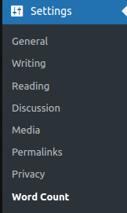
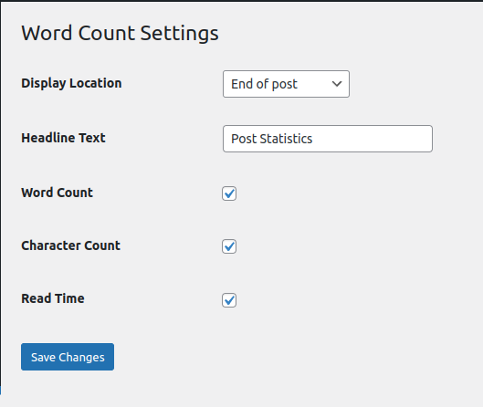
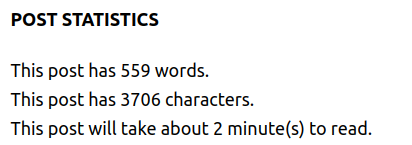

Wordpress Plugin
------------
* Post-Word-Statistics is wordpress plugin, it displays information on post page information about quantity of words, characters of the post and reading time. 

Installation
------------
* Upload the plugin in to your wordpress, then activat 

Menu
------------
* Once the plugin is installed, open 'Settings' from the left menu, click the 'Word Count' link

    

Settings
------------
* The plugin have few options to configure
    Display Locaton - position of the statistics block on the post page (top or bottom)
    Headline Text - text to display
    Word Count - number of words in the post
    Character Count - number of characters in the post
    Read Time - post reading time in minutes, based on the average reading time of 225 words per minute

    

Output
------------
* The plugin will display statistics on post pages

    

